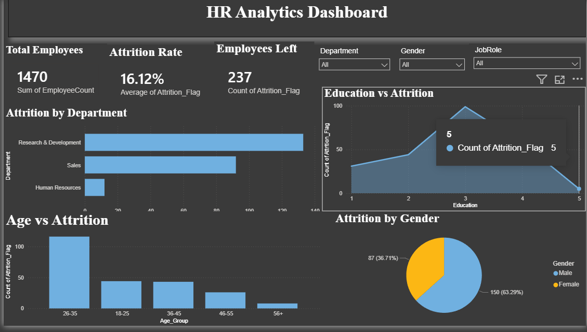

# HR Analytics Dashboard

## Overview

This project presents an interactive HR Analytics Dashboard developed using Microsoft Power BI to analyze employee attrition, salary distribution, gender-wise attrition, departmental trends, and employee experience.

## Dashboard Preview



---

## Features

- Total Employees KPI
- Attrition Rate KPI
- Employees Left KPI
- Attrition by Department
- Attrition by Gender
- Salary vs Attrition
- Experience vs Attrition
- Interactive Filters
  - Department
  - Gender
  - Job Role

---

## Technologies Used

- Microsoft Power BI
- Microsoft Excel
- SQL
- Python

---

## Project Structure

```
HR-Attrition-Analytics-Dashboard
│
├── Excel/
├── SQL/
├── Python/
├── Power BI/
├── dashboard.png
└── README.md
```

---

## Author

NAME:V.Nirmala
PHONE: 8897629348s
E-MAIL:
